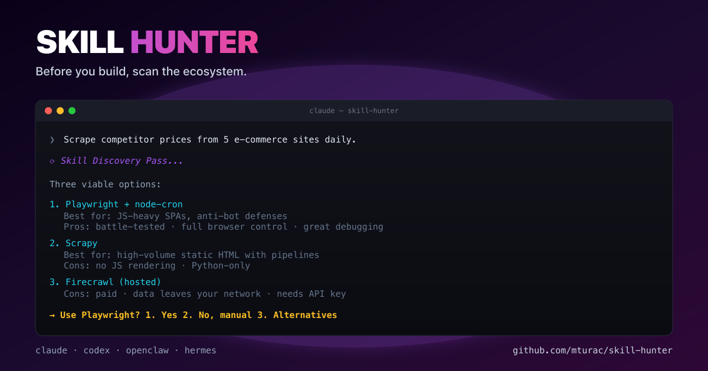

# Skill Hunter



**Stop your AI agent from reinventing the wheel.**

Skill Hunter is a pre-execution layer for coding and automation agents. It makes agents check for existing skills, MCP servers, CLIs, packages, APIs, templates, repos, and workflows before building from scratch.

> Your agent should check the toolbox before building a hammer.

## The Problem

Agents are good at writing code, sometimes too good. They will happily generate a custom scraper, parser, integration, or workflow even when a safer maintained tool already exists.

Skill Hunter adds the missing pause: understand the task, search the ecosystem, compare options, score risk, ask for approval when needed, then reuse or build minimally.

## Before / After

**Before**

User asks: "Parse these PDFs and extract invoices."

Agent writes a custom parser immediately.

**After Skill Hunter**

Agent checks PDF libraries, OCR tools, invoice extraction APIs, existing repo utilities, and asks whether accuracy, cost, privacy, or offline processing matters before writing code.

## What It Does

1. Classifies the request.
2. Checks whether reusable solutions likely exist.
3. Compares candidates by fit, maintenance, permissions, security, docs, license, and effort.
4. Recommends reuse, adaptation, minimal build, custom build, or asking the user.
5. Gates risky installs, credentials, external services, posting, and destructive actions on approval.

## Install

### Claude Code plugin

```text
/plugin marketplace add mturac/skill-hunter
/plugin install skill-hunter@skill-hunter
```

### Codex CLI plugin

```bash
codex plugin marketplace add mturac/skill-hunter
```

Then enable it in `~/.codex/config.toml`:

```toml
[plugins."skill-hunter@skill-hunter"]
enabled = true
```

### OpenClaw / ClawHub

```bash
openclaw skills install openclaw-skill-hunter
# or
clawhub install openclaw-skill-hunter
```

Published at [clawhub.com/mturac/openclaw-skill-hunter](https://clawhub.com/mturac/openclaw-skill-hunter).

### `npx skills`

```bash
npx skills add mturac/skill-hunter@skill_hunter -g -y
```

### Local clone

```bash
git clone https://github.com/mturac/skill-hunter.git
cd skill-hunter
./install.sh all
./install.sh status
```

## Supported Runtimes

| Runtime | Install surface | Hook support |
|---|---|---|
| Claude Code | plugin or `./install.sh claude` | interactive `UserPromptSubmit` |
| Codex CLI | plugin or `./install.sh codex` | interactive `UserPromptSubmit` |
| OpenClaw | `./install.sh openclaw` or ClawHub | skill only |
| Hermes / agentskills.io | `npx skills` or `./install.sh hermes` | skill only |
| Cursor | `./install.sh cursor` | rule file |

The hook only fires in interactive Claude/Codex sessions. Headless modes rely on skill matching.

## Output Shape

```text
Skill Discovery Pass:
- Goal:
- Existing options checked:
- Best option:
- Decision:
- Risk:
- Next action:
```

Decision values: `USE_EXISTING`, `ADAPT_EXISTING`, `BUILD_MINIMAL`, `BUILD_CUSTOM`, `ASK_USER`, `AVOID`.

## Trust Score

The planned Trust Score turns discovery into a transparent decision model:

- Relevance, 0-25
- Maintenance, 0-20
- Adoption, 0-15
- Security, 0-25
- Documentation, 0-10
- Fit cost, 0-5

See [docs/TRUST_SCORE.md](./docs/TRUST_SCORE.md).

## Security Model

Skill Hunter never silently installs or executes unknown tools. Approval is required for risky installs, credentials, paid/external services, email/calendar/social posting, networked execution, destructive commands, or writes outside the repo.

See [docs/SECURITY_MODEL.md](./docs/SECURITY_MODEL.md).

## Examples

See [examples/](./examples) for PDF conversion, scraping, trivial-skip behavior, custom parser decisions, and credential-scope warnings.

## Benchmarks

Benchmarks live in [benchmarks/tasks.yaml](./benchmarks/tasks.yaml). They compare baseline agent behavior against Skill Hunter guided behavior across scraping, PDF parsing, PR review, and approval-gated social posting.

## Roadmap

- P0: centralized prompts, docs, benchmark examples, install/version consistency.
- P1: Trust Score implementation, security audit model, CLI skeleton, local audit mode, JSON output.
- P2: real ClawHub/GitHub/MCP/npm/PyPI providers, GitHub Action, demo GIF, public benchmark results.

See [docs/ROADMAP.md](./docs/ROADMAP.md).

## Known Limitations

- Provider discovery is not implemented yet; current behavior is instruction/hook driven.
- Benchmark results are illustrative until a runner exists.
- OpenClaw currently installs a skill copy, not a hook.
- Skill Hunter reduces unsafe behavior, but does not replace human security review.

## Contributing

Good first issues: provider stubs, Trust Score implementation, benchmark runner, adapter consistency, JSON output mode, and release checklist.

## License

MIT — see [LICENSE](./LICENSE).
